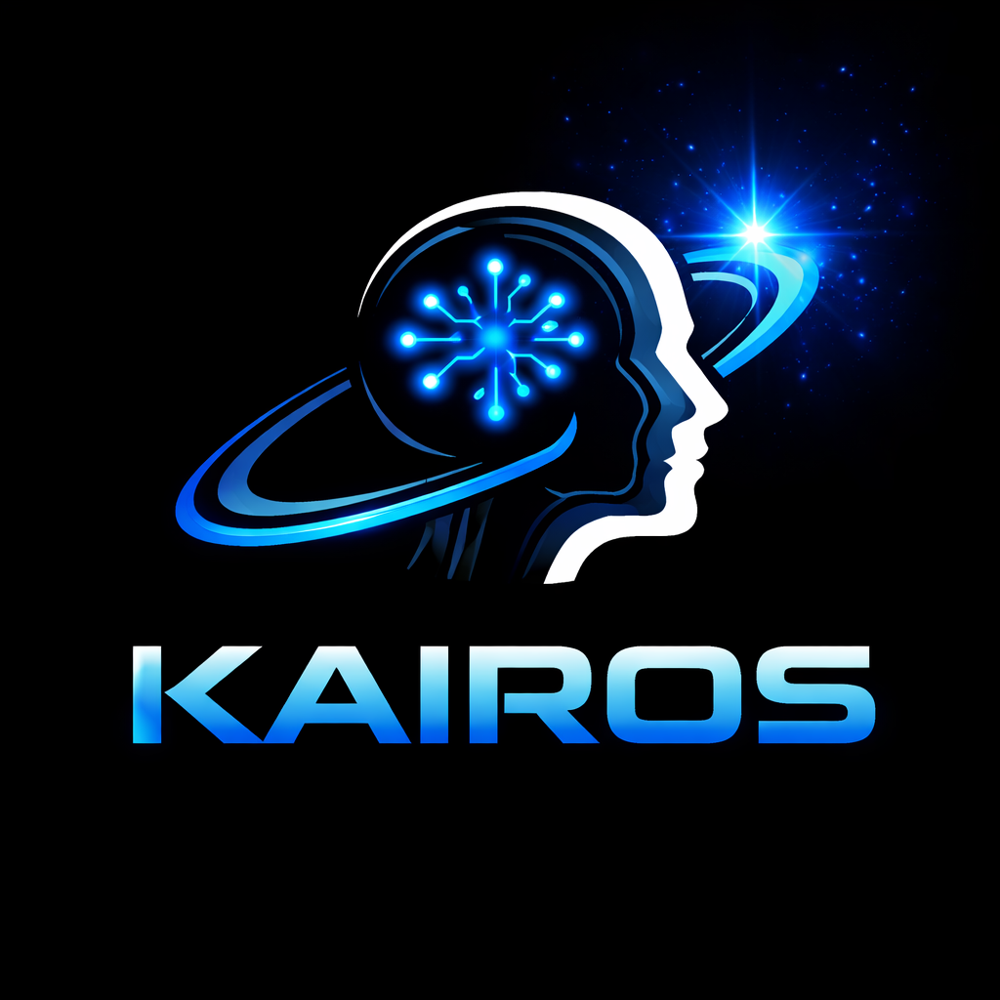
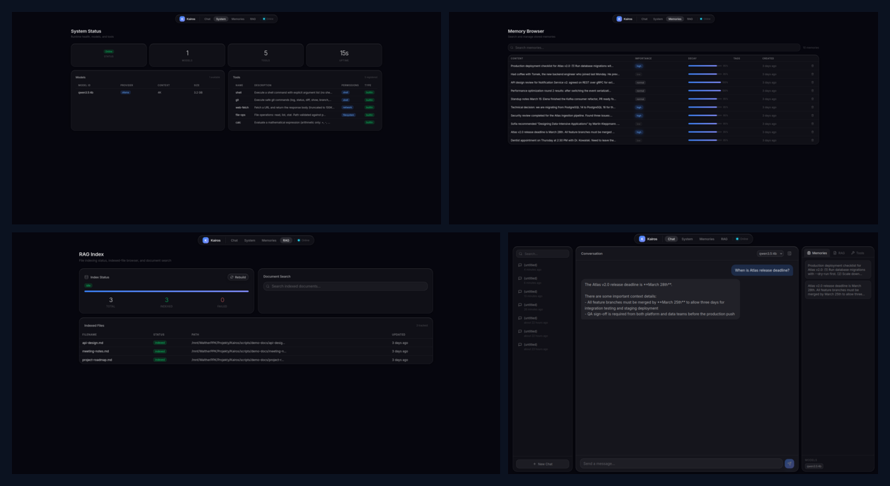
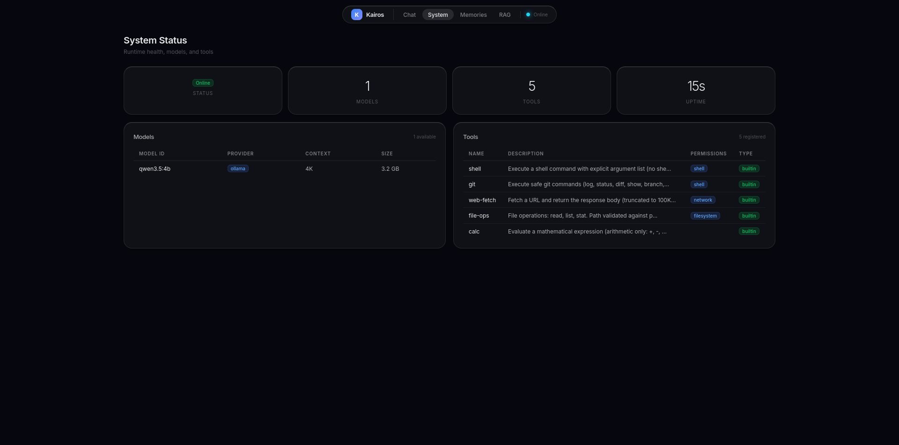
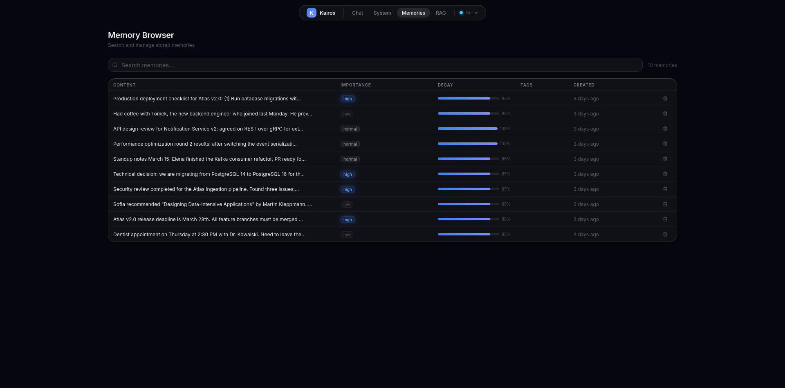
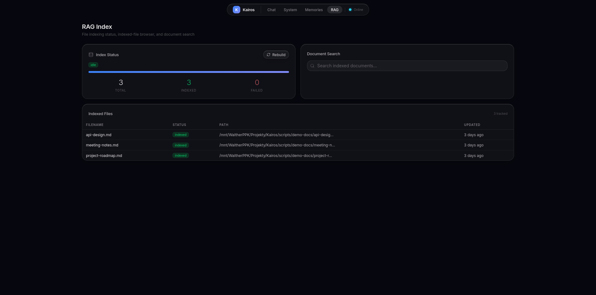
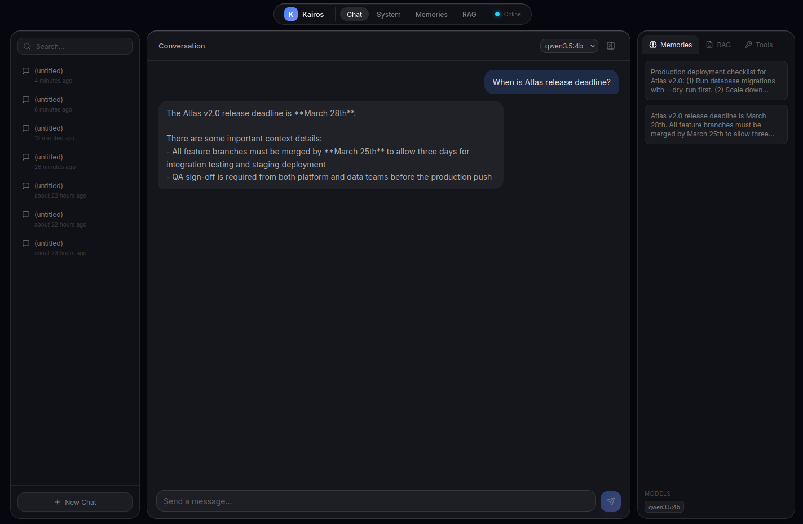

<p align="center">
  
</p>

<h1 align="center">Kairos</h1>

<p align="center">
  <strong>Personal AI Runtime</strong> — persistent memory, RAG, and MCP for local LLMs
</p>

<p align="center">
  <a href="https://go.dev"></a>
  <a href="https://www.rust-lang.org"></a>
  <a href="LICENSE"></a>
  <a href="https://github.com/jxroo/kairos/actions/workflows/ci.yml"></a>
  <a href="https://github.com/jxroo/kairos/releases"></a>
  <a href="https://github.com/jxroo/kairos/stargazers"></a>
  <a href="https://discord.gg/kairos"></a>
</p>

<p align="center">
  
</p>

---

## Features

- **Persistent Memory** — semantic search, importance scoring, and exponential decay across sessions
- **RAG Pipeline** — automatic file indexing, intelligent chunking, hybrid vector + full-text search
- **Inference Bridge** — Ollama and llama.cpp with an OpenAI-compatible chat API
- **MCP Server** — stdio and SSE transport for Claude Desktop, Cursor, and other MCP clients
- **Tool Runtime** — sandboxed JavaScript execution with permissions and audit logging
- **Vector Search** — Rust engine (fastembed + usearch HNSW) via CGO for fast similarity search
- **Auto-Discovery** — filesystem watcher with debounced indexing for automatic document ingestion
- **Local-First** — all data stays on your machine, works fully offline

## Quick Start

### Install

```bash
curl -sSL https://raw.githubusercontent.com/jxroo/kairos/main/install.sh | bash
```

Or via Homebrew:

```bash
brew install jxroo/tap/kairos
```

<details>
<summary>Build from source</summary>

Requires Go 1.24+ and Rust (stable toolchain).

```bash
git clone https://github.com/jxroo/kairos.git
cd kairos
make build

# Run with the Rust library on your loader path
LD_LIBRARY_PATH=vecstore/target/release ./kairos start
```

</details>

### Run

```bash
kairos start
curl http://localhost:7777/health
# {"status":"ok","version":"0.1.0","uptime":"3s"}
```

### Use

```bash
# Store a memory
curl -X POST http://localhost:7777/memories \
  -H "Content-Type: application/json" \
  -d '{"content": "The project deadline is March 30th", "importance": "high"}'

# Search memories
curl "http://localhost:7777/memories/search?query=deadline"

# Chat with context (requires Ollama running)
curl -X POST http://localhost:7777/v1/chat/completions \
  -H "Content-Type: application/json" \
  -d '{"model": "llama3:latest", "messages": [{"role": "user", "content": "What do you remember about deadlines?"}]}'
```

The chat endpoint automatically injects relevant memories and RAG results into the context.

## Screenshots

| System Status | Memory Browser |
|:---:|:---:|
|  |  |
| **RAG Index** | **Conversations** |
|  |  |

## Architecture

```
┌──────────────────────────────────────────────┐
│                CLI (cobra)                   │
├──────────────────────────────────────────────┤
│           HTTP API Server (chi)              |
├─────────┬──────────┬──────────┬──────────────┤
│ Memory  │   RAG    │  Tools   │     MCP      │
│ Engine  │ Pipeline │ Runtime  │  Server      │
├─────────┴──────────┼──────────┴──────────────┤
│                    │   Inference Bridge      │
│    SQLite (WAL)    │  (Ollama / llama.cpp)   │
├────────────────────┴─────────────────────────┤
│   Rust Vector Engine (embeddings, HNSW)      │
│              via CGO bridge                  |
└──────────────────────────────────────────────┘
```

Go handles I/O-bound work (HTTP, SQLite, file watching, orchestration). Rust handles compute-bound work (embeddings via fastembed, HNSW search via usearch). The two communicate through a CGO bridge in `internal/vecbridge/`.

## MCP Integration

Add Kairos as an MCP server in Claude Desktop or Cursor:

```json
{
  "mcpServers": {
    "kairos": {
      "command": "/path/to/kairos",
      "args": ["mcp"]
    }
  }
}
```

For HTTP-based MCP clients, connect to `http://localhost:7777/mcp/sse` while the daemon is running.

See [docs/mcp.md](docs/mcp.md) for Cursor setup, SSE transport details, and available tools.

## Configuration

Kairos reads from `~/.kairos/config.toml`. All settings have sensible defaults — you can run without a config file.

```toml
[server]
port = 7777

[memory]
engine = "rust"       # or "fallback" for pure-Go mode
```

See [docs/configuration.md](docs/configuration.md) for the full reference.

## API

18 REST endpoints — OpenAI-compatible chat, memories, RAG search, tools, and MCP.

See [docs/api.md](docs/api.md) for the full reference with request/response examples.

## Python SDK

```python
from kairos_sdk import Client

with Client() as client:
    client.create_memory("Project deadline is March 30th", importance="high")
    results = client.search_memories("deadline")
```

See [docs/python-sdk.md](docs/python-sdk.md) for installation and full API documentation.

## FAQ

**Do I need Ollama to use Kairos?**
No. Memory, RAG, and tools work independently. You need Ollama or llama.cpp only for chat completions. Kairos discovers providers at startup and works with whatever is available.

**Does Kairos send data anywhere?**
No. Everything runs locally. Your memories, documents, embeddings, and conversations stay in `~/.kairos/`. No analytics, no telemetry, no external API calls.

**What about GPU acceleration?**
Kairos itself runs on CPU. GPU acceleration is handled by your LLM provider — Ollama automatically uses available GPUs. The Rust vector engine is CPU-only, which is sufficient for embedding workloads.

**Can I use Kairos without Rust?**
Yes. Set `memory.engine = "fallback"` for a pure-Go implementation with hash-based embeddings and brute-force search. Fine for development; Rust recommended for production.

**What models work with Kairos?**
Any model available through Ollama or llama.cpp — Llama 3, Mistral, Phi, Qwen, Gemma, and more. Kairos uses the OpenAI chat completions format.

## Contributing

See [CONTRIBUTING.md](CONTRIBUTING.md) for guidelines. Questions? Join us on [Discord](https://discord.gg/kairos).

## License

[MIT](LICENSE)
